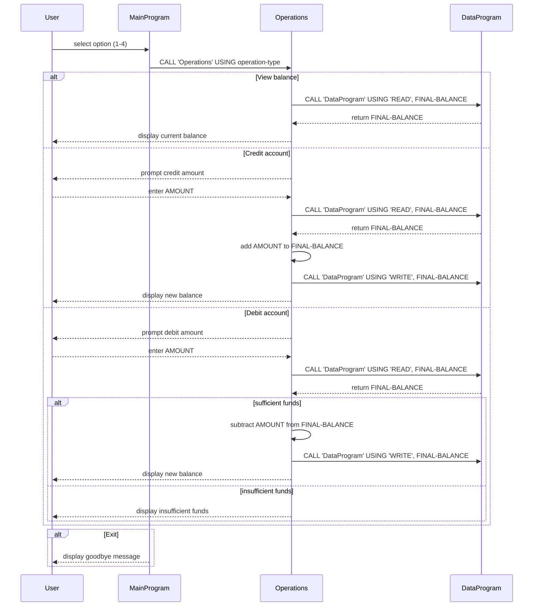

# COBOL Legacy Code Documentation

## Overview
This documentation describes the COBOL source files in `src/cobol` and explains the purpose of each program, the main operations they perform, and the business rules for student account balance handling.

## File summary

### `src/cobol/main.cob`
- Program ID: `MainProgram`
- Purpose: Application entry point and user interface.
- Behavior:
  - Displays a menu for account management.
  - Accepts user input to select between viewing balance, crediting account, debiting account, or exiting.
  - Calls `Operations` with an operation type indicator.

### `src/cobol/operations.cob`
- Program ID: `Operations`
- Purpose: Coordinate account operations and handle user interaction for credit/debit operations.
- Behavior:
  - Receives an operation type from `MainProgram`.
  - For `TOTAL`, reads the current balance from `DataProgram` and displays it.
  - For `CREDIT`, prompts for an amount, reads the balance, adds the amount, writes the updated balance back to `DataProgram`, and displays the new balance.
  - For `DEBIT`, prompts for an amount, reads the balance, checks funds, and if sufficient, subtracts the amount, writes the updated balance back, and displays the new balance.
  - If funds are insufficient for a debit, it displays an error message without updating the balance.

### `src/cobol/data.cob`
- Program ID: `DataProgram`
- Purpose: Simplified balance storage and retrieval service.
- Behavior:
  - Stores a local working balance value (`STORAGE-BALANCE`).
  - On `READ`, returns the current stored balance to the caller.
  - On `WRITE`, updates the stored balance to the provided value.

## Key functions and data flow
- `MainProgram` handles user selection and delegates operations.
- `Operations` handles the account-specific logic and user prompts.
- `DataProgram` acts as the storage backend for the student account balance.
- The programs communicate using `CALL ... USING ...` semantics typical in COBOL.

## Business rules for student accounts
- Student accounts have a current balance stored in `DataProgram`.
- The application starts with a default balance of `1000.00`.
- Balance inquiries simply read and display the current balance.
- Credit transactions:
  - Prompt the user for a credit amount.
  - Add the amount to the balance.
  - Persist the updated balance.
- Debit transactions:
  - Prompt the user for a debit amount.
  - Check that the current balance is greater than or equal to the debit amount.
  - If sufficient, subtract the amount and persist the updated balance.
  - If insufficient, do not change the balance and display `Insufficient funds for this debit.`
- Invalid menu selections are handled by showing an error message and re-displaying the menu.

## Notes
- The COBOL program is structured as a simple console-based account manager.
- Data persistence is simulated in-memory via `DataProgram` and does not persist outside the running process.
- The code is suitable for modernization or refactor work focused on separating UI, business logic, and data storage.

## Sequence diagram

